JavaWeb 入门
===

### JavaWeb基础

#### XML
- XML 介绍与用途
- XML 语法和规则
- XML 语意约束
- Java解析XML
- XPath路径表达式
- 文档结构
    - 每一行必须是XML声明
    `<?xml version="1.0" encoding="utf-8">`
    - 有且只有一个根节点
    - XML标签的书写规范与HTML相同
- 书写规范
    - 合法的标签名
        - 建议使用英文，小写字母，单词之间使用“-”分割
        - 语义化
    - 合理使用属性
    - 适当的注释与缩进
    - 特殊字符实体引用与CDATA标签
        ``` 
             <![CDATA[
                内容
                    ]]>
        ```
    - 有序的子元素
    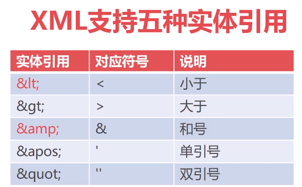
- DTD 简单易用语义约束方式
    ``` 
    hr.dtd
    <!ELEMENT hr(employee+)>
    <!ELEMENT employee (name,age,salary,department)>
    <!ATTLIST employee no CDATA"">
    <!ELEMENT name (#PCDATA)>
    ```
    - 利用<!ELEMENT>标签，定义XML文档中允许出现节点及其数量,hr.xml
    ``` 
    <!ELEMENT hr(employee)> hr节点下只允许出现一个employee子节点
    <!ELEMENT employee(name,age,salary,department)> eleployee下必须包含四个节点，且按顺序出现
    
    #PCDATA 标示文本元素
    <!ELEMENT name (#PCDATA)>
    ```
    - 节点数量描述符
    ``` 
    <!ELEMENT hr (employee+)> hr节点下最少出现一个employee子节点
    <!ELEMENT hr (employee*)> hr节点下可能出现0-n个employee子节点
    <!ELEMENT hr (employee?)> hr节点下可能出现0-1个employee子节点
    ```
    - XML引用DTD文件
    ```
    <!DOCTYPE 根节点 SYSTEM "dtd文件路径">
    <!DOCTYPE hr SYSTEM "hr.dtd">
    ```
    ``` 
    <?xml version="1.0" encoding="UTF-8" ?>
    <!ELEMENT hr (employee+)>
    <!ELEMENT employee (name,age,salary,department)>
    <!--<!ATTLIST employee 属性字段 属性属性 属性默认>-->
    <!ATTLIST employee no CDATA "">
    <!--<!ELEMENT name (#PCDATA纯文本)>-->
    <!ELEMENT name (#PCDATA)>
    <!ELEMENT age (#PCDATA)>
    <!ELEMENT salary (#PCDATA)>
    <!ELEMENT department (dname,address)>
    <!ELEMENT dname (#PCDATA)>
    <!ELEMENT address (#PCDATA)>
    ```
- XML Schema
> 提供了数据类型，格式限定，数据规范
#### Servlet
``` 
<!--    声明Servlet-->
    <servlet>
        <!--  servlet的别名-->
        <servlet-name>first</servlet-name>
        <servlet-class>com.imooc.servlet.FirstServlet</servlet-class>
    </servlet>
<!--    将servlet与url绑定-->
    <servlet-mapping>
        <servlet-name>first</servlet-name>
        <url-pattern>/hi</url-pattern>
    </servlet-mapping>
```
1. 声明名称与使用一致 命名要有意义
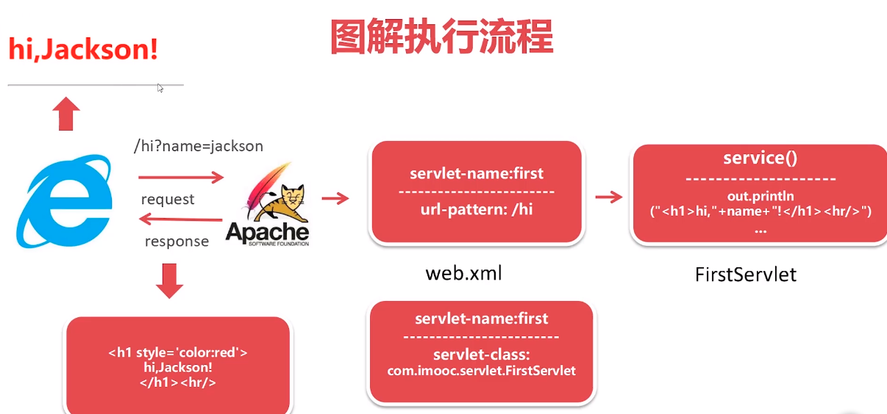
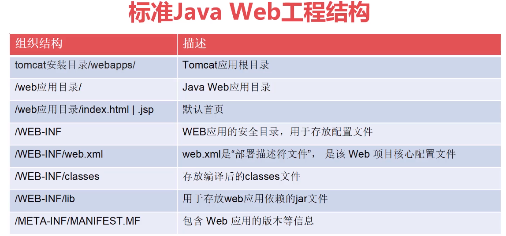
- 开发标准步骤
    - 创建Servlet类，继承HttpServlet
    - 重写service方法，编写程序代码 (请求处理核心方法，无论是get or post)
    - 配置web.xml 绑定URL
- Servlet 访问方法
    - `http://ip:port/content-path/url-mapping`
    - `content-path` 上下文路径 默认工程名称
- 请求参数
    - request.getParameter() 接收单个参数
    - request.getParameterValues() 接收多个同名参数
    - 获取method() `String methodName = requeset.getMethod()`
- GET POST
- Servlet生命周期
    - 装载 web.xml
    - 创建 构造函数
    - 初始化 init()
    - 提供服务 service()
    - 销毁 destory()
    当访问url的时候servlet才会被创建，tomcat只会创建一个servlet对象
- 注解简化配置
    - 注解简化web应用程序的配置过程
    - servlet核心注解：@WebServlet
- 启动时加载Servlet
    - web.xml 使用 <load-on-startup> 设置启动加载
    - `<load-on-startup>0~999</load-on-startup>` 从小到大执行
    ``` 
    <servlet>
        <!--  servlet的别名-->
        <servlet-name>first</servlet-name>
        <servlet-class>com.imooc.servlet.FirstServlet</servlet-class>
        <load-on-startup>0</load-on-startup>
    </servlet>
    ```
    or 注解
    ``` 
    @WebServlet(urlPatterns="/url",loadOnStartup=2)
    ```
#### JSP
- JSP执行过程
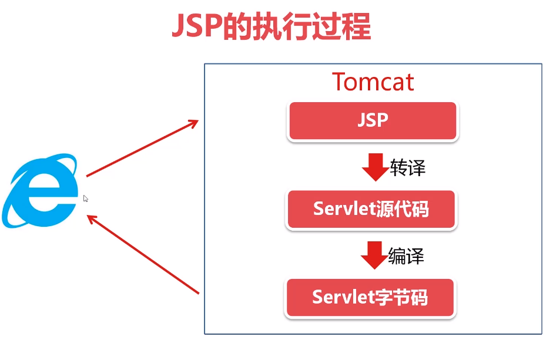
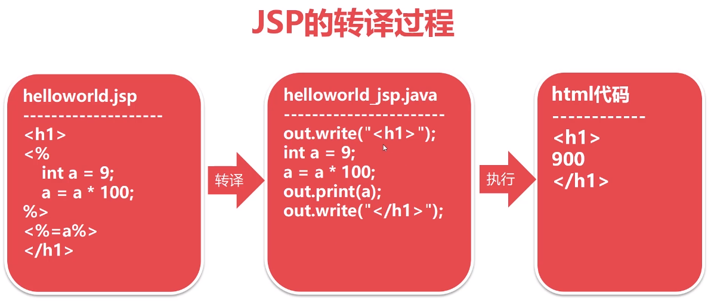
- 基本语法
    - JSP代码块
    - JSP声明构造块
    - JSP输出指令
    - JSP处理指令
- JSP代码块
    - 在JSP页面中嵌入Java代码
    - 语法 `<% JavaCode %>`
- 声明构造块
    - jsp声明构造块用于声明变量或方法
    - 文法 `<%! 声明语句 %>`
    - 示例 `<%! public int add(int a,int b) { return a+b; } %>`    
- Jsp指令输出
    - 显示Jsp页面中显示java代码执行结果
    - 文法 `<%= java代码  %>`
    - 示例 `<%= "<b>" + name + "</b>"  %>` 其实就是out.println()
- Jsp 处理指令
    - JSP处理指令用于提供JSP执行过程中的辅助信息
    - 文法 `<% @jsp命令 %>`
    - 示例 `<%@ page import="java.uitl.*" %>`
    - 常用处理指令
        - `<%@ page %>` 定义当前JSP页面全局设置 `<%@ page import="java.util.HashMap"%>`
        - `<%@ include %>` 将其他JSP页面与当前JSP页面合并
        - `<%@ taglib %>` 引入jsp标签库
    - 注释
        - `<%--注释--%>` jsp注释
        - `//./*..*/` java代码注释
        - `<!--html-->` html注释
- Jsp页面重用
``` 
<%@page contentType="text/html;charset=utf-8"%>
<%@include file="include/header.jsp" %>
<% 
    out.println("<h1>新闻标题</h1>");
    out.println("<p>content....</p>");
%>
<%@include file="include/footer.jsp" %>
```
#### Servlet与JSP进阶
- Java Web核心特征
- Servlet核心对象
- JSP九大内置对象
- Http请求结构
    - 三部分： 请求行 请求头 请求体
    ``` 
    String userAgent = req.getHeader("User-Agent");
    resp.setContentType("text/html;charset=utf-8");
    if (userAgent.indexOf("Linux")>0 && userAgent.indexOf("Android")<0){
        resp.getWriter().println("不支持Linux系统访问");
    }
    ```
- 响应的结构
    - 三部分： 相应行， 相应头，相应体
    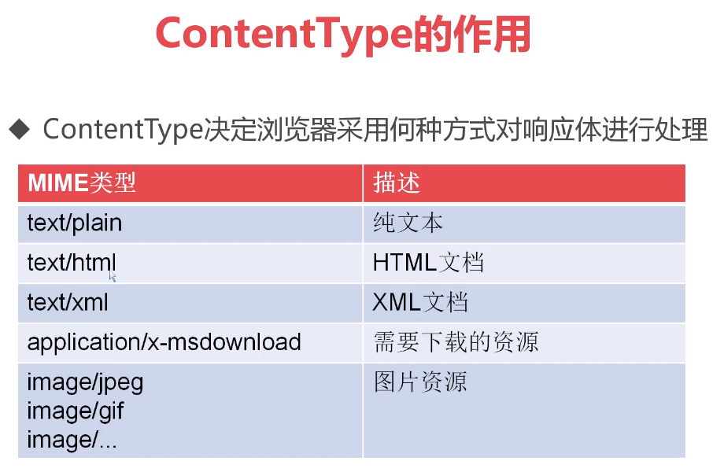
- 请求转发与响应重定向的使用
    - 对于多个Servlet(JSP)之间跳转有两种方式
    - `request.getRequestDispatcher(跳转url).forward(req,resp)` 请求转发 url不会变换
    - `response.sendRedirect()` 相应重定向 url会发生变化 浏览器会发生两次url请求
- 请求转发与响应重定向的原理
    - 请求转发是服务器跳转 只会产生一次url请求 `req.getRequsetDispatcher(url),forward(req,resp)`
    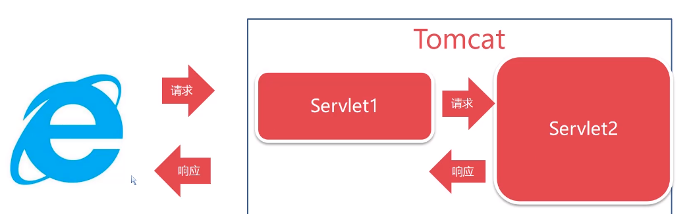
    - 相应重定向 会发生两次url请求 (浏览器跳转) `resp.sendRedirect()`
    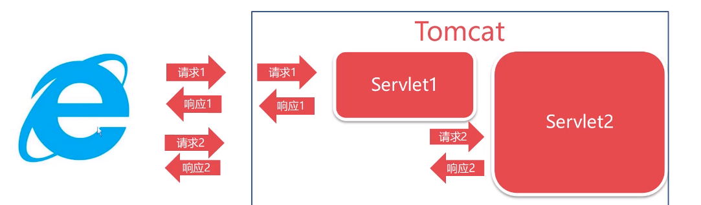
- 设置请求自定义属性
    - 设置 `request.setAttribute(属性名称,属性值)`
    - 获取 `Object attr = request.getAttribute(属性名称)`
#### Cookie & Section
- Cookie 保持到本地的文本信息
    - 设置 如果没有设置有效期就是当前浏览器窗口的生命周期 `Cookie cookie = new Cookit(key,value)`
    ``` 
         resp.setContentType("text/html;charset=utf-8");
         System.out.println("用户登录成功");
         Cookie cookie = new Cookie("user","admin");
         cookie.setMaxAge((60*60*27*7)); // 设置有效期 s
         resp.addCookie(cookie);
         resp.getWriter().println("设置cookie");
    ```
    - 获取 `req.getCookies()`
    ``` 
        Cookie[] cs = req.getCookies();
        for(Cookie c:cs){
            System.out.println(c.getName() + " : " + c.getValue());
        }
    ```
- Session 用户回话 保持浏览器对应信息
    > 默认存储在Tomcat的内存中 具有时效性 默认是30min
    - Session底层原理
    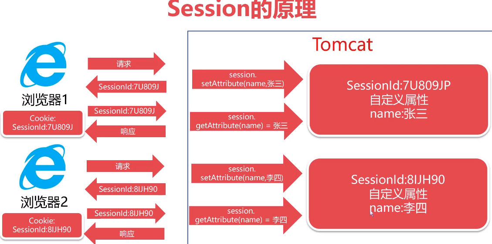 
- ServletContext与三大作用域对象
    - ServletContext(Servlet上下文对象) 是web应用全局对象
    - 一个web应用只会创建一个ServletContext对象
    - ServletContext随着web应用启动而自动创建 app整个生命周期
    ``` 
        // 设置
        ServletContext context = req.getServletContext();
        context.setAttribute("copyright","2019 WorldLink");
        context.setAttribute("auth","dollarkiller");
        
        // 获取
        ServletContext context = req.getServletContext();
        String copyright = (String)context.getAttribute("copyright");
        String auth = (String)context.getAttribute("auth");
        resp.setContentType("text/html;charset=utf-8");
    
        resp.getWriter().println("copy: "+copyright +" auth: "+ auth);
    ```
    - JavaWeb 三大作用于对象
        - HttpServletRequest请求对象 请求结束就会被销毁
        - HttpSession 用户回话对象 session过期就会被销毁
        - ServletContext web应用全局对象 贯穿整个web应用的生命周期
            
#### 中文乱码问题
- Tomcat默认使用字符集ISO-8859-1 
``` 
req.setCharacterEncoding("UTF-8");
resp.setContentType("text/html;charset=utf8");
String utf8Ename = new String(ename.getBytes("iso-8859-1"),"utf-8)
```
- 对于get tomcat8.x 默认get请求做了utf8转换
    - 对于tomcat早期版本 需要修改配置文件 apache-conf-server.xml
        - `<port="8080" protocol="http/1.1" URIEncoding="UTF-8">` <8配置

#### web.xml 常用配置
- 修改web应用默认首页
    ``` 
        <welcome-file-list>
            <welcome-file>index.html</welcome-file>
        </welcome-file-list>
    ```
- Servlet通配符映射及初始化参数
    - 全局参数
        ``` 
        <context-param>
            <param-name>username</param-name>
            <param-value>DollarKiller</param-value>
        </context-param>
        
        获取
         ServletContext context = req.getServletContext();
         String name = context.getInitParameter("username");
        ```
    - 
- 设置404,500等状态码默认页面
``` 
String url = request.getRequestURL(); 获取当前访问url 返回是stringbuffer

@WebServlet("/pwd/*")
public class PatternServlet extends HttpServlet {
    @Override
    protected void doGet(HttpServletRequest req, HttpServletResponse resp) throws ServletException, IOException {
        resp.setContentType("text/html;charset=utf-8");
        String url = req.getRequestURI().toString();
        System.out.println(url);
        String id = url.substring(url.lastIndexOf("/")+1);
        PrintWriter out = resp.getWriter();
        if (id.equals("1")){
            out.println("1");
        }else{
            out.println("O(∩_∩)O哈哈~");
        }
    }
}

<error-page>
    <error-code>404</error-code>
    <location>/error/404.html</location>
</error-page>
<error-page>
    <error-code>500</error-code>
    <location>/error/500.html</location>
</error-page>
```
- JSP 9大内置对象
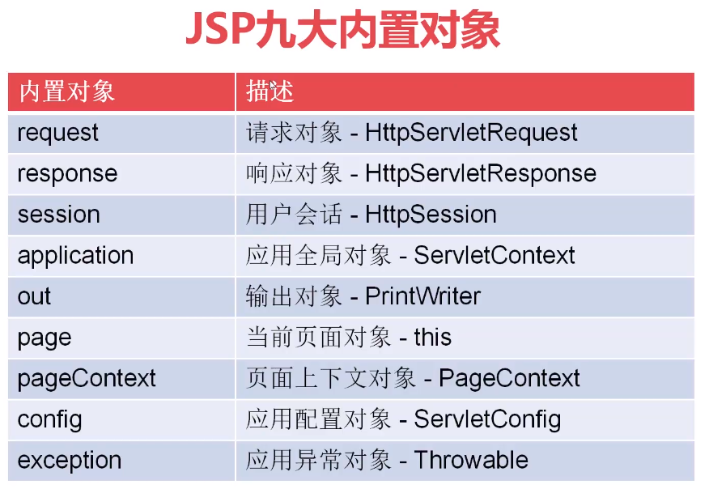
- Web应用程序的打包与发布
    - war包发布
    - 发布路径:{TOMCAT_HTML}/webapps
#### JSTL与EL表达式
- JSTL常用语法
- EL JSP的输出
- EL (Expression Language) 表达式，简化JSP输出
    - 基本语法
        - `${表达式}`
    - EL的作用域对象 requestScope 作用域对象 
    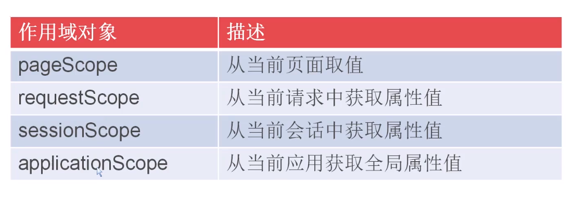
    - 如果没有说明就会重小到大依次获取
    ``` 
        <h1>姓名: ${requestScope.student.name}</h1>
        <h2>手机: ${requestScope.student.mobile}</h2>
        <h2>评级: ${requestScope.grade}</h2>
    ```
    - EL表达式输出
        - 文法 `${[scope].Attribute[.子属性]}`
        - 本质toString()
        - `${emp.salary + 300}` 可以运输
        - `${1 <=3 && 2>4}` bool
        - 获取输入参数值
            - param对象简化参数 `${param.参数名}`
- JSTL 标签库 简化JSP标签
    - 组件
        - spec 定义包 必须
        - impl 实现包 必须
        - compat 1.0 兼容包 备选
    - 安装
        - 实现1
            - Jar包 /WEB-INF/lib 推荐 只会对当前工程生效
        - 实现2
            - 复制到tomcat安装目录的lib下
    - JSTL标签库种类
        - 核心标签库 core
        - 格式化输出标签库 fmt
        - sql操作标签库 sql
        - xml操作标签库 xml
        - 函数标签库 functions
    - 引入核心库
        - `<%@ taglib prefix="c" uri="http://java.sun.com/jsp/jstl/core" %>`
        - META-INF 描述数据
    - 判断标签
        - JSTL核心库提供两组判断标签
        - `<c:if>` 单分支判断
        - `<c:choose> <c:when> <c:otherwise>` 多分支判断
        ``` 
        <c:if test="${score>=60}">
        <h1 style="color:green">恭喜你，已通过测试</h1>
        </c:if>
        <c:if test="${score<60}">
            <h1 style="color:red">再接再厉</h1>
        </c:if>
        
        <c:choose>
            <c:when test="${grade == 'A'}">
                <h2>你很优秀</h2>
            </c:when>
            <c:when test="${grade == 'B'}">
                <h2>不错欧</h2>
            </c:when>
            <c:when test="${grade == 'C'}">
                <h2>加油欧</h2>
            </c:when>
            <c:otherwise>
                <h3>错误</h3>
            </c:otherwise>
        </c:choose>
        ```
    - 遍历集合
        - `<c:forEach>` 遍历集合中的每一对对象
        ``` 
        items数据源 varStatus 索引
        <c:forEach var="p" items="${persons}" varStatus="idx">
        第${idx.index + 1}位<br/>
        姓名:${p.name} 性别${p.sex} 年龄 ${p.age}
        </c:forEach>
        
        <c:forEach items="${requestScope.companies}" var="c" varStatus="idx">
            <h2>${idx.index}  ${c.cname} === ${c.url}</h2>
        </c:forEach>
        ```
    - fmt格式化标签库
        - uri `http://java.sun.com/jsp/jstl/fmt`
        - `<fmt:formatDate value="" pattern=""> ` 格式化日期标签
        - `<fmt:formatNumber value="" pattern="">` 格式化数字标签
        ``` 
        <%--
        formatData pattern
        yyyy 四位年
        MM 两位月
        dd 两位日
        HH 24小时
        hh 12小时
        mm 分钟
        ss - 秒数
        SSS 毫秒
        --%>
        <fmt:formatDate value="${requestScope.now}" pattern="yyyy年MM月dd日 HH:mm:ss:SSS"/>
        ```
        - 数字格式化
        ``` 
        <fmt:formatNumber value="${requestScope.amt}" pattern="0.00"/> 
        ```
        - c：out
            - 默认值
                - `<c:out value="${nothing}" default="无"/>`
            - 转义
                - `<c:out value="${html}" escapeXml="true"></c:out>`
#### JAVAEE MVC登录注册案例
- 文件上传
    - 需要包
        - Commons IO
        - Commons FileUpload
        ``` 
            public static String getUUIDFileName(String fileName) {
                String file = fileName.substring(fileName.lastIndexOf("."));
                file = UUID.randomUUID().toString().replace("-","") + file;
                return file;
            }
        
            // 文件上传项
            // 文件上传功能
            // 获得弄个文件上传名称
            String fileName = fileItem.getName();
            // 通过工具类获得唯一文件名
            String uuidFileName = UploadUtils.getUUIDFileName(fileName);
    
            // 获取文件上传的数据
            InputStream is = fileItem.getInputStream();
            // 获取文件上传路径
            String path = this.getServletContext().getRealPath("/UPLOAD");
            // 将输入流对接到输出流
            String url = path + "\\" + uuidFileName;
            OutputStream os = new FileOutputStream(url);
            int len = 0;
            byte[] b = new byte[1024];
            while ((len = is.read(b))!=-1) {
                os.write(b,0,len);
            }
            is.close();
            os.close();
        ```
#### JSON and Javascript
- Json与字符串互相转换
- JSON.parse() 装换为JSON对象
- Json.stringify() 将JSON对象转换为str
#### FastJSON Java双剑合璧
```
	格式化
    @JSONField(format="yyyy-MM-dd HH:mm:ss")
	private Date hdate;
	private Float salary;
    不解析此
    @JSONField(serialize=false)
    

    序列化
    Employee employee = new Employee();
    employee.setEmpno(4488);
    employee.setEname("王晓东");
    employee.setSalary(1000f);
    employee.setDname("市场部");
    Calendar c = Calendar.getInstance();
    c.set(2019, 0,30,0,0,0);
    employee.setHdate(c.getTime());
    // FastJSON 提供了JSON对象，完成对象与JSON的装换
    String json = JSON.toJSONString(employee);
    
    反序列化
    Employee emp = JSON.parseObject(json,Employee.class);
    System.out.println(emp);
```
FastJSON对象数组序列化与反序列化
```
String json = JSON.toJSONString(emplist);
System.out.println(json);
List<Employee> emps = JSON.parseArray(json,Employee.class);
for(Employee e: emps) {
    System.out.println(e);
}
```
#### JAVA正则表达式
语法规则
- `[abc]` a or b or c
- `[a-zA-Z]` z~z A~Z 
- `[0-9]` \d
- `X{n}` X 恰好n次
- `X{n,}` X 至少n次
- `X{n,m}` n~m次
- `\D`非数组
- `\s` 空白字符 制表符 换行符
- `\S` 非空
- `\w` 单词字符 `[a-zA-Z_0-9]`
- `\W` 非单词str
- `^`开头 `$`结尾
```
public class Zzts {
	public static void main(String[] args) {
		String data = "1";
		String regex = "\\D";
		boolean flag = data.matches(regex);
		System.out.println(flag);
	}
}
.matches 返回true of false
```
#### 过滤器
> 请求拦截 预处理 
- web资源权限访问控制
- 请求字符集编码处理
- 内容敏感字符词汇过滤
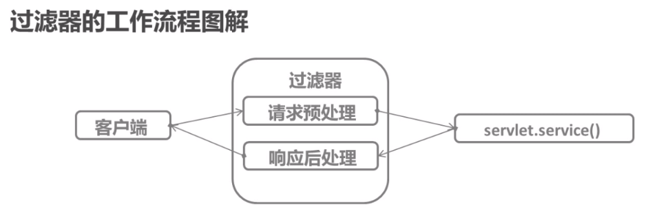
- 生命周期
  - web应用程序启动时，web服务器创建Filter实例对象，以及对象的实例化
  - 当请求访问与过滤相关的web资源时，过滤器拦截请求，完成指定功能
  - Filter对象创建后会驻留在内存中，在web应用溢出或服务器停止时才会销毁
  - 过滤器的创建和销毁由web服务器负责
- 实现步骤
  - 1.编写Java类实现Filter接口，并实现其doFIlter方法
  - 2.web.xml文件中对filter类进行注册，并设置所拦截的资源
  - 3.过滤器链
    - 在一个web应用中，多个过滤器组合起来称为一个过滤器链
    - web.xml文件中注册顺序

####  过滤器实现
  - 1.创建过滤器类 需要实现Filter接口
  - init() 初始化过滤器
  - destory() 销毁
  - doFilter 完成功能 
  - 配置过滤器 web.xml
    - 1.注册过滤器
    - 2.拦截映射配置
    ```
    <filter>
        <filter-name>charsecterEncodingFIlter</filter-name>
        <filter-class>filter.CharacterEncodingFilter</filter-class>
    </filter>
    <filter-mapping>
        <filter-name>charsecterEncodingFIlter</filter-name>
        <url-pattern>/*</url-pattern>
    </filter-mapping>
    ```
    ```
    	@Override
        public void doFilter(ServletRequest arg0, ServletResponse arg1, FilterChain arg2)
                throws IOException, ServletException {
            // TODO 自动生成的方法存根
            arg0.setCharacterEncoding(config.getInitParameter("charset"));
            arg2.doFilter(arg0,arg1);
        }

    ```
#### 监听器
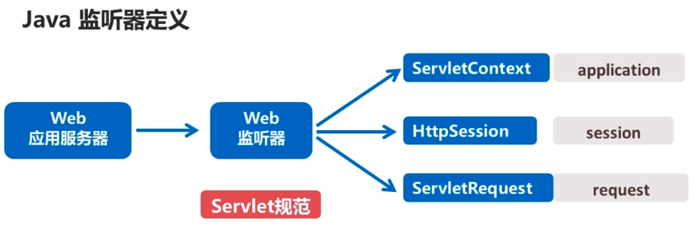
- ServletContext,HtpSession,ServletRequest 等域对象的创建,销毁及其属性修改发生变化的事件
- 监听器可以在事件发生前后进行一些必要的处理操作
- 常见应用场景
  - 统计页面在线人数
  - 页面访问量统计
  - 应用启动时完成信息初始化工作
  - 与Spring结合
- 实现步骤
  - 编写java实现类监听接口,并实现其接口方法
  - web.xml 进行注册
  ```
   <listener>
  	<listener-class>com.dollarkiller.listener.MyFirstListener</listener-class>
  </listener>
  ```
  - 多监听器启动顺序
    - 按web.xml 配置顺序
  - 监听器的分类
    - 监听对象
      - ServletContext 对象监听器
      - HttpSession 对象监听器
      - ServletRequest对象监听器
    - 监听事件
      - 域对象自生的创建和销毁事件监听器
      - 域对象中的属性的创建,替换和消除事件监听器
        - ServletContext
        - HttpSession
          - get/set
        - ServletRequset
      - 绑定到session中某个对象的状态事件监听器
    - 域对象自身的创建和销毁事件监听器
      - ServletContext
        - ServletContextListener
      - HttpSession
        - HttpSessionListener
      - ServletRequset
        - ServletRequestListener
    - 属性监听器
      - SerletContext
        - ServletCOntextAttributeListener
      - HttpSession
        - HttpSessionAttributeListener
      - ServletRequset
        - ServletRequsetAttributeListener
      - HttpSessionBindingListener 绑定解绑
      - 不需要web.xml注册

#### 验证码
- kcaptcha
  - jsp/servlet
....

#### 解析Excel/Word 生成Excel/World
- 第三方包 POI
- 拆解任务
  - 上传文件 Commons FileUpload
  - Excel,Word    Apache POI
  - 下载文件 ServletOuputStream
- 这个我现在还用不到我就先不写了

#### Linux Java生产环境
- profile
  ```
  JAVA_HOME=/opt/jdk1.8.0_144
  CLASSPATH=.:$JAVA_HOME/lib
  PATH=$OATH:$JAVA_HTML/bin
  export JAVA_HTML CLASSPATH PATH

  source profile
  ```

#### 小demo
- 页面 Jsp JSTL JS+CSS
- 核心控制 Filter Listener Servlet
- 技术应用
  - JSP+JSTL
  - Servket及其内部判断
  - LocalCache
  - Filter解决数据传输乱码

#### SSO单点登录
- 单点登录服务器,web应用*2
- 技术 Jsp Servlet HttpClient
