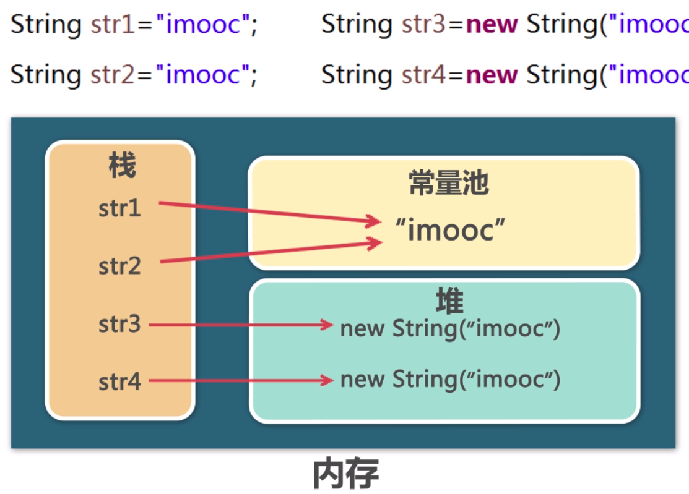
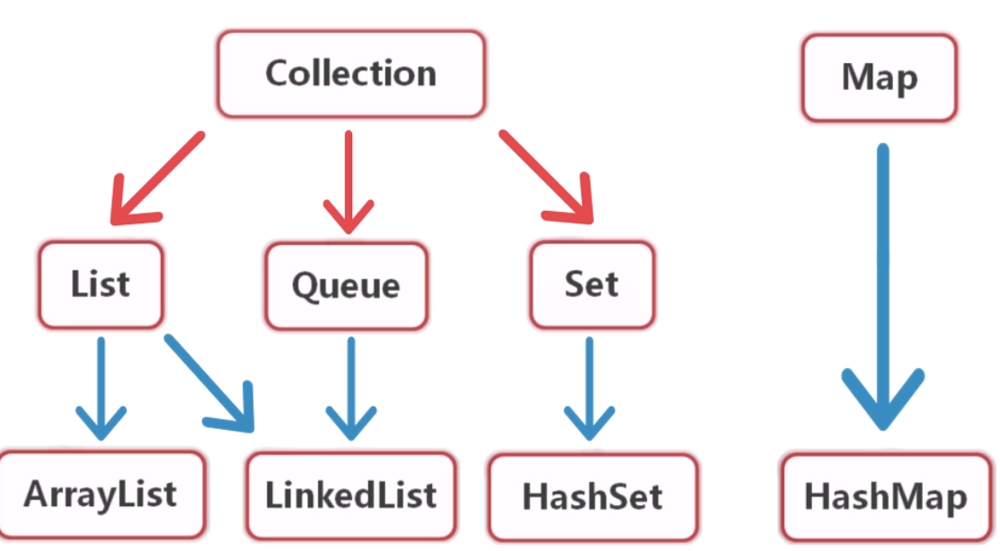

# JavaReview
时隔多年的Java复习

```
package com.hello

public class Hello
{
    public String name;
    
    public Hello(String name) {
        this.name = name;
    }
    
    public Hello(){
        
    }
    
    public int add(int a,int b) {
        return a + b;
    } 
    
}
```
- `final int N = 6` 定义常亮 
> 实例方法可使用静态属性 静态属性不能调用实例方法

- 类继承
```
public class Car {
    private int displacement;
    public Car(int displacement) {
        this.displacement = displacement;
    }
    public void showDisplacement() {
        System.out.println(this.getClass().toString() + "排气" + this.displacement);
    }
}

public class Bus extends Car {

    public Bus(int dislacement ) {
        super(dislacement);
    }
}
```
- 接口与实现
``` 
    public static void main(String[] args) {
        System.out.println("----Oracle----");
        run(new Oracle());
        System.out.println("----Mysql----");
        run(new Mysql());
    }
    // 只要实现IDatabase的类都接收
    private static void run(IDatabase db) {
        db.connect();
        db.close();
    }
```
- 集合与泛型(list, collection, generic)
    - List<> 集合
    - ArrayList<> 泛型
    - 数组 引用类型
        - `int[] insList = new int[10]`;
        - `int[] insList = {1,2,3,4,5,6,7,8,9}`
        - 通过下标访问 `insList[10]` `insList.length`
- 方法重载
    - 返回类型相同，but参数列表不同
    - 可变参数列表
    ``` 
    public void sum(int... n){
        int sum = 0;
        for(int i:n){
            sum = sum + i;
        }
    }
    ```
- New关键字
``` 
Scanre scanre;
在内存的栈上开辟空间 
new Scanre
在内存的堆上开辟空间
Scanre scanre = new Scanre;
把堆空间的内存地址存放到栈上
每new一次就会在堆上开辟空间
```
- 构造方法 没有返回值类型 必须和类名一致

### 三大面向对象特性

#### 封装
可见性
getter/setter
#### 导入包
- 导入所有`java import com.hello.pak.*;`
- 指定包下特定的类 `import com.hello.className`
- 在程序中直接通过包名加类名的方式导入`com.hello.className tex = new com.hello.className`
- 普通代码块
    - 在类中定义并加上start 会最优先调用
    - 类中定义为构造代码块 在对象被调用的时候调用，有限与构造方法
    - 方法中 代码块结束后 代码块中的变量就会消失
- 方法重写 有继承关系的子类中 方法名相同 参数列表相同(参数顺序，个数，类型) 返回值相同
- 方法重载 同一个类中 方法名相同 参数列表不同(参数顺序，个数，类型)
- super() super关键字调用父类方法
- 子类构造默认调用的是父类的无参数构造
- 当实例化子类 父静>子静>父构>子构
    - 子类访问父亲成员方法super.func() 父类属性super.name 父类构造super()
    - equals() 判断类是否相同 if是string判断string是否相等 
    - final class `public final class Animal` 标示类没有子类不允许被继承
    - final func `public final void func()` 该方法不允许被子类重写，但是可以被子类继承使用
    - 注解
        
### 设计模式
- 单例模式
    - 要点
        - 某个类只能有一个实例
        - 必须自行创建实例
        - 必须自行想整个系统提供这个实例
    - 实现   
        - 只提供私有的构造方法
        - 含有该类的静态私有对象
        - 提供一个静态的公有方法用于创建，获取静态私有对象
    - 饿汉式
        - 对象创建过程中实例化
        - 静态公有方法中实例化
    饿汉：对创建对象实例的时候直接初始化 空间换时间
    ```
    public class SingleMode {
    
        private SingleMode() {
    
        }
    
        private static SingleMode instance= new SingleMode();
    
        public static SingleMode getInstance(){
            return instance;
        }
    }
    ```
    - 懒汉式 不会直接实例化
    ``` 
    public class LazyPerson {
        private LazyPerson() {
    
        }
    
        private static SingleMode instance = null;
    
        public static SingleMode getInstance() {
            if(instance == null){
                instance = new SingleMode();
            }
            return instance;
        }
    }
    ```
- 多态
    - 向上转型 (隐式转型) 自动转型 父类引用指向子类实例
        - 小类装大类 可以调用子类重写的方法和父类派生下来的方法
        - 子类特有的方法是没有的
        - 父 = new 子
    - 向下转型 (强制类型转换)
        - 满足转换条件才能转换
        - 父 tep= new 子
        - 子 temp=(子)tep
    - instanceof 判断实例
    ``` 
    public class Master {
        // 方案一  编写方法 重载 传入不同的类型的动物
        public void feed(Cat cat) {
            cat.eat();
            cat.playBall();
        }
        public void feed(Dog dog) {
            dog.eat();
            dog.sleep();
        }
        // 方案二 编写方法传入动物的父类，方法中通过类型转换，指定子类方法
        public void feed(Animal obj) {
            if(obj instanceof Cat) {
                Cat temp = (Cat)obj;
                temp.eat();
                temp.playBall();
            }else if(obj instanceof Dog) {
                Dog temp = (Dog)obj;
                temp.eat();
                temp.sleep();
            }
        }
    }
    ```
#### 抽象类
- abstract public class
    - 父类只是知道子类应该包含怎样的方法准确知道这些只类如何实现这些方法
- 抽象方法 `abstract static void func()`

#### 接口
- 约定行为规范   
接口当中抽象方法不会加abstract 
``` 
public interface INet {
    public void network();
    int TEMP = 20;
    // JDK1.8 >>> 
    // 可以在实现类中重写  可以通过接口的引用调用
    default void connection() {  // default 可以定义默认方法
        System.out.println("default function");
    }
    // 只能通过接口名被调用
    static void func() {
        System.out.println("static function");
    }
}
调用接口默认方法 this.connection();
INet.super.funcName() 重写后 调用接口的默认方法 
INet.funcName() 调用接口构造方法

当实现两个接口都有同名的默认方法的时候
就要本类重写
当两个接口都有同名的常亮的时候调用就需要  接口名.countName调用
```
- 接口的继承
    - 接口可以多继承
    - 都有同名的默认方法需要重写
- 内部类
    - 成员内部类 
    ``` 
    public class Person {
        int age;
    
        public Heart getHeart() {
            return new Heart();
        }
        // 内部类
        /**
        1. 内部类在外部使用时，无法直接实例化，需要借由外部类信息才能完成实例化
        2. 内部类的访问修饰符 可以任意 但是访问范围会搜影响
        3. 内部类可以直接掉外部类的方法和属性 如果重名外部类.this.age获取外面属性
        4. 外部类获取内部类属性 new Heart().int; 无法直接访问
        5. 内部类编译后.class文件命名：外部类￥内部类.class
        */
        class Heart {
            int age = 13
            public String beat() {
                return "大脑在颤抖";
            }
        }
    }
    获取内部类方式1：
    Person.Heart heart = new Person().new Heart();
    方法2：
    Person lili = new Person();
    Person.Heart myHeart = lili.new Heart()
    方法三：
    myHeart = lili.getHeart() 
    ```
    - 静态内部类
    ``` 
    statui class Hear {
        
    }
    1. 静态内部类中，只能直接访问外部类静态成员，如果需要调用非静态成员，可以通过对象实例访问
    2. 静态内部类对象实例时，可以不依赖外部类对象
    ```
    - 方法内部类
    ``` 
    // 1. 定义在方法内部 作用范围在方法内
    // 2. class 前面不能添加修饰符
    // 3. class中不能包含静态成员
    // 4. class 中可以包含final，ab..修饰的成员
    public Object getHeart() {
        class Heart {
            public int age = 13[
            public String beat() {
                return this.age;
            }
        }
        return new Heart().beat();
    }
    ```
    - 匿名内部类
    ``` 
    public static void main(String[] args) {
            PersonTest test = new PersonTest();
    //        Man one = new Man();
    //        Woman two = new Woman();
    //        test.getRead(one);
    //        test.getRead(two);
            test.getRead(new Person() {
                @Override
                public void read() {
                    System.out.println("匿名内部类");
                }
            });
        }
    1. 匿名内部类没有类型名称，实例对象名称
    2. 无法使用private publi 等修饰符
    3. 无法编写构造方法 可以通过构造代码块实现
    4. 不能出现静态成员
    5. 可以实现接口可以继承父类，但不可兼得
    ```

### Java常用工具类

#### 异常
Throwable 
- Error 
    - 内存溢出
    - 线程死锁
    - 不需要太关注
- Exception 程序可以处理的异常
    - Unchecked Exception 非检查异常 不要求强制处理的异常
        - RuntimeException 空指针 越界 算数 类型转换 
    - Checked Exception 检查异常 程序需要处理异常
        - Io
        - SQL异常
- 异常处理
    - 抛出异常 捕获异常
    一个try块可接0-多个catch块，如果没有catch块则必须跟一个finally块
    ``` 
    try{
        
    }catch (Exception ex){
        
    }finally {
        // 无论是否发生异常，finally 代码块中的代码总会被执行。
           
           在 finally 代码块中，可以运行清理类型等收尾善后性质的语句。
    }
    ```
    
    - System.exit(1); 终止程序运行
- throw & throws
    - throws 如果方法可能出现异常，但是没有能力处理这种异常，可以在方法声明处用throws子句声明抛出异常
    ``` 
    throws语句用在方法定义时声明该方法要抛出的异常类型
    public void method() throws Exception1,Exception2...{
        // 可能产生异常的代码
    }
    当方法抛出异常列表中的异常时，方法将不对这些类型及其子类型的异常做处理，而抛向调用该方法
    ```
    - throw 抛出异常
        - 只能是Throwable或者是其子类的实例对象
        - 1. 自己抛出 自己捕获 代码内写try catch 抛出自己捕获
        - 2. throws声明
    - 自定义异常 extends Exception
    - 异常链 逐层抛出
    - 尽量在finally语句中区释放占用资源的操作
#### 包装类
- 装箱 基本数据类型 -> 包装类
- 拆箱 包装类 -> 基本数据类型
``` 
        // 1. 自动装箱
        int t1 = 2;
        Integer t2 = t1;
        System.out.println(t1);
        System.out.println(t2);
        // 2. 手动装箱
        Integer t3 = new Integer(t1);
        System.out.println(t3);
        System.out.println("-----------------");
        // 拆箱
        // 1. 自动拆箱
        int t4 = t2;
        // 2. 手动拆箱
        int t5 = t3.intValue();
        System.out.println(t4);
        System.out.println(t5);
        System.out.println("-----------------");
        double t6 = t2.doubleValue();
        System.out.println(t6);
        
        // 其他类型转换
            // 基本数据类型转str
            int t1 = 2;
            String t2 = Integer.toString(t1);
            System.out.println(t2);
            // str 转基本数据类型
            // 1. 通过包装类的parse
            int t3 = Integer.parseInt(t2);
            // 2. 先将str转换为包装类然后通过自动类型转换完成
            int t4 = Integer.valueOf(t2);
            System.out.println(t3);
            System.out.println(t4);
```
#### 字符串处理类
- String
    - 创建
    ``` 
    String s1 = "dollarkiller";
    String s2 = new String();
    String s3 = new String("dol");
    ```
    - 方法
        - length()
        - indexOf() 第一次出现的位置
        - lastIndexOf() 最后出现的位置
        - `substring(int beginIndex,[end])` `[end]`选填 获取开始到结束的str
        - trim() 去掉前后的空格
        - equals() 比对str的字符是否是一样的
        - toLowerCase() 转小写
        - toUpperCase() 转大写
        - charAt(int index) 取指定位置的str
        - split(String regex分隔符,int limit) str转数组
        - getBytes() str转为byte数组 
        - replace() 替换
    - getBytes()
        ``` 
            String str = new String("Java编程基础");
            byte[] arrs = str.getBytes();
            for(byte i:arrs) {
                System.out.print(i + " ");
            }
            System.out.println();
            String str1 = new String(arrs);
            System.out.println(str1);
        ```
    - 等于运算符与equals方法的区别
        - equals 内容一样就相同
        
- StringBuilder
    - 区别
        - String具有不可变性，而StringBuilder不具备
    - 建议
        - 当频繁操作str时，使用StringBuilder
    - StringBuilder和StringBuffer
        - StringBuffer是线程安全 StringBuilder没有so性能会高一点
    - append()
    - charAt()
    - delete()
    - indexOf()
    - insert()
    - length()
    - replace()
    - substring()
    - toString()
#### 集合 java.util
- 无法预测存储数量的数据
- 存储具有一对一关系的数据
- 进行数据的增删
- 数据重复
- 体系结构
    - Collection 类的对象
        - List 序列  
        - Queue 队列
            (List Queue存放数据有序 可以重复)
        - Set 集合
            无序不允许重复
    - Map 键值对
    
- Collection
    - 动态增长
    - 查询 更新 复杂度O(1) 删除OR插入复杂度O(n)
    - 元素可以为null
    - add()
    - clear() 清空
    - contains(obj) 判断是否包含obj 某个元素
    - isEmpty() 集合是否为空
    - iterator() 迭代器
    - remove() 移除某个元素
    - size()
    - tiArray() 转换为数组
- ArrayList  
    - get(int index) 返回指定位置的元素 
    - indexOf()
    - set(index,obj)
    - 小案例： 公告管理
        - 公告的添加和显示
        - 在指定位置插入公告
        - 删除公告
        - 修改公告
- Set概述
    - HashSet 哈希集
    - 良好的存储和查找
    - 不能重复 可以有null so只允许有一个null
- Iterator(迭代器)
    > Iterator接口可以以统一的方式对各种集合元素进行遍历
    - hasNext() 检测集合中是否还有下一个元素
    - next() 返回结合中下一个元素
    ``` 
        Set set = new HashSet();
        set.add("blue");
        set.add("red");
        set.add("block");
        set.add("yellow");
        set.add("white");

        System.out.println("集合中的元素为: ");
        Iterator it = set.iterator();
        // 遍历迭代器并输出
        while (it.hasNext()) {
            System.out.print(it.next() + ",");
        }
    ```
- 泛型 `Set<Cat> set = new HashSet<Cat>();` 这样调用就可以不同类型转换了
- 移除
 ``` 
 Set<Cat> set1 = new HashSer<Cat>();
 for(Cat cat:set) {
    if(cat.getMonth()<5) {
        set1.add(cat)
    }
 }
 set.removeAll(set1)
 在查询的时候是不运行修改的
 ```    
- Map (key-value)
    - HashMap 给予哈希表的Map接口实现
    - 运行有null键
    - key值不允许重复
    - entrySet() 返回所有键值对
    - keySet() 返回所有key值
    - get(key)
    - put(k,v)
    - remove(k)
    - values()
    - containsKey() 判断key值是否存在

#### 集合排序
- 集合中的基本数据类型排序
- 结合中的str排序
- Comparator接口
- Comparable接口
- 数组排序
    ``` 
    int[] arr = {15,35,25,78,95,12}
    Arrays.sort(arr)
    ```
### 泛型
- `List<Animal> list = new ArrayList<Cat>()` // 变量声明的类型必须匹配传递给实际对象的类型
- 泛型作为方法参数
``` 
    public void sellGoods(List<? extends Goods> goods) {
        for(Goods g:goods) {
            g.sell();
        }
    }
```
- 自定义泛型类
``` 
public class NumGeneric<E> {
    private E num;
    public E getNum() {
        return num;
    }
    public void setNum(E num) {
        this.num = num;
    }

    public static void main(String[] args) {
        NumGeneric<Integer> intNum = new NumGeneric<>();
        intNum.setNum(16);
        System.out.println(intNum.getNum());
    }
}
```
- 自定义泛型方法
```
public class FuncGeneric {
    public <T> void printValue(T t) {
        System.out.println(t);
    }

    public <T extends Number> void prNum(T t){
        System.out.println(t);
    }

    public static void main(String[] args) {
        FuncGeneric fg = new FuncGeneric();
        fg.printValue("Hello Generic");
        fg.printValue(12313);
    }
}
```


