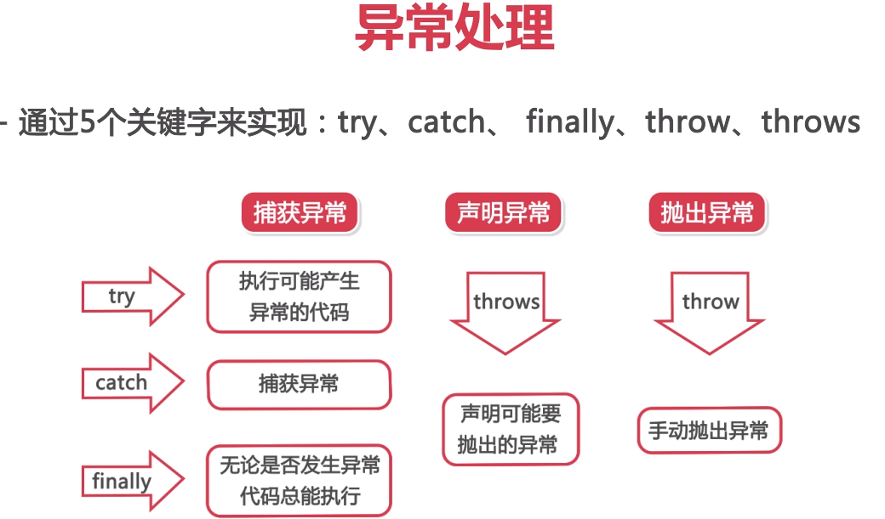

# JavaReview
时隔多年的Java复习

```
package com.hello

public class Hello
{
    public String name;
    
    public Hello(String name) {
        this.name = name;
    }
    
    public Hello(){
        
    }
    
    public int add(int a,int b) {
        return a + b;
    } 
    
}
```
- `final int N = 6` 定义常亮 
> 实例方法可使用静态属性 静态属性不能调用实例方法

- 类继承
```
public class Car {
    private int displacement;
    public Car(int displacement) {
        this.displacement = displacement;
    }
    public void showDisplacement() {
        System.out.println(this.getClass().toString() + "排气" + this.displacement);
    }
}

public class Bus extends Car {

    public Bus(int dislacement ) {
        super(dislacement);
    }
}
```
- 接口与实现
``` 
    public static void main(String[] args) {
        System.out.println("----Oracle----");
        run(new Oracle());
        System.out.println("----Mysql----");
        run(new Mysql());
    }
    // 只要实现IDatabase的类都接收
    private static void run(IDatabase db) {
        db.connect();
        db.close();
    }
```
- 集合与泛型(list, collection, generic)
    - List<> 集合
    - ArrayList<> 泛型
    - 数组 引用类型
        - `int[] insList = new int[10]`;
        - `int[] insList = {1,2,3,4,5,6,7,8,9}`
        - 通过下标访问 `insList[10]` `insList.length`
- 方法重载
    - 返回类型相同，but参数列表不同
    - 可变参数列表
    ``` 
    public void sum(int... n){
        int sum = 0;
        for(int i:n){
            sum = sum + i;
        }
    }
    ```
- New关键字
``` 
Scanre scanre;
在内存的栈上开辟空间 
new Scanre
在内存的堆上开辟空间
Scanre scanre = new Scanre;
把堆空间的内存地址存放到栈上
每new一次就会在堆上开辟空间
```
- 构造方法 没有返回值类型 必须和类名一致

### 三大面向对象特性

#### 封装
可见性
getter/setter
#### 导入包
- 导入所有`java import com.hello.pak.*;`
- 指定包下特定的类 `import com.hello.className`
- 在程序中直接通过包名加类名的方式导入`com.hello.className tex = new com.hello.className`
- 普通代码块
    - 在类中定义并加上start 会最优先调用
    - 类中定义为构造代码块 在对象被调用的时候调用，有限与构造方法
    - 方法中 代码块结束后 代码块中的变量就会消失
- 方法重写 有继承关系的子类中 方法名相同 参数列表相同(参数顺序，个数，类型) 返回值相同
- 方法重载 同一个类中 方法名相同 参数列表不同(参数顺序，个数，类型)
- super() super关键字调用父类方法
- 子类构造默认调用的是父类的无参数构造
- 当实例化子类 父静>子静>父构>子构
    - 子类访问父亲成员方法super.func() 父类属性super.name 父类构造super()
    - equals() 判断类是否相同 if是string判断string是否相等 
    - final class `public final class Animal` 标示类没有子类不允许被继承
    - final func `public final void func()` 该方法不允许被子类重写，但是可以被子类继承使用
    - 注解
        
### 设计模式
- 单例模式
    - 要点
        - 某个类只能有一个实例
        - 必须自行创建实例
        - 必须自行想整个系统提供这个实例
    - 实现   
        - 只提供私有的构造方法
        - 含有该类的静态私有对象
        - 提供一个静态的公有方法用于创建，获取静态私有对象
    - 饿汉式
        - 对象创建过程中实例化
        - 静态公有方法中实例化
    饿汉：对创建对象实例的时候直接初始化 空间换时间
    ```
    public class SingleMode {
    
        private SingleMode() {
    
        }
    
        private static SingleMode instance= new SingleMode();
    
        public static SingleMode getInstance(){
            return instance;
        }
    }
    ```
    - 懒汉式 不会直接实例化
    ``` 
    public class LazyPerson {
        private LazyPerson() {
    
        }
    
        private static SingleMode instance = null;
    
        public static SingleMode getInstance() {
            if(instance == null){
                instance = new SingleMode();
            }
            return instance;
        }
    }
    ```
- 多态
    - 向上转型 (隐式转型) 自动转型 父类引用指向子类实例
        - 小类装大类 可以调用子类重写的方法和父类派生下来的方法
        - 子类特有的方法是没有的
        - 父 = new 子
    - 向下转型 (强制类型转换)
        - 满足转换条件才能转换
        - 父 tep= new 子
        - 子 temp=(子)tep
    - instanceof 判断实例
    ``` 
    public class Master {
        // 方案一  编写方法 重载 传入不同的类型的动物
        public void feed(Cat cat) {
            cat.eat();
            cat.playBall();
        }
        public void feed(Dog dog) {
            dog.eat();
            dog.sleep();
        }
        // 方案二 编写方法传入动物的父类，方法中通过类型转换，指定子类方法
        public void feed(Animal obj) {
            if(obj instanceof Cat) {
                Cat temp = (Cat)obj;
                temp.eat();
                temp.playBall();
            }else if(obj instanceof Dog) {
                Dog temp = (Dog)obj;
                temp.eat();
                temp.sleep();
            }
        }
    }
    ```
#### 抽象类
- abstract public class
    - 父类只是知道子类应该包含怎样的方法准确知道这些只类如何实现这些方法
- 抽象方法 `abstract static void func()`

#### 接口
- 约定行为规范   
接口当中抽象方法不会加abstract 
``` 
public interface INet {
    public void network();
    int TEMP = 20;
    // JDK1.8 >>> 
    // 可以在实现类中重写  可以通过接口的引用调用
    default void connection() {  // default 可以定义默认方法
        System.out.println("default function");
    }
    // 只能通过接口名被调用
    static void func() {
        System.out.println("static function");
    }
}
调用接口默认方法 this.connection();
INet.super.funcName() 重写后 调用接口的默认方法 
INet.funcName() 调用接口构造方法

当实现两个接口都有同名的默认方法的时候
就要本类重写
当两个接口都有同名的常亮的时候调用就需要  接口名.countName调用
```
- 接口的继承
    - 接口可以多继承
    - 都有同名的默认方法需要重写
- 内部类
    - 成员内部类 
    ``` 
    public class Person {
        int age;
    
        public Heart getHeart() {
            return new Heart();
        }
        // 内部类
        /**
        1. 内部类在外部使用时，无法直接实例化，需要借由外部类信息才能完成实例化
        2. 内部类的访问修饰符 可以任意 但是访问范围会搜影响
        3. 内部类可以直接掉外部类的方法和属性 如果重名外部类.this.age获取外面属性
        4. 外部类获取内部类属性 new Heart().int; 无法直接访问
        5. 内部类编译后.class文件命名：外部类￥内部类.class
        */
        class Heart {
            int age = 13
            public String beat() {
                return "大脑在颤抖";
            }
        }
    }
    获取内部类方式1：
    Person.Heart heart = new Person().new Heart();
    方法2：
    Person lili = new Person();
    Person.Heart myHeart = lili.new Heart()
    方法三：
    myHeart = lili.getHeart() 
    ```
    - 静态内部类
    ``` 
    statui class Hear {
        
    }
    1. 静态内部类中，只能直接访问外部类静态成员，如果需要调用非静态成员，可以通过对象实例访问
    2. 静态内部类对象实例时，可以不依赖外部类对象
    ```
    - 方法内部类
    ``` 
    // 1. 定义在方法内部 作用范围在方法内
    // 2. class 前面不能添加修饰符
    // 3. class中不能包含静态成员
    // 4. class 中可以包含final，ab..修饰的成员
    public Object getHeart() {
        class Heart {
            public int age = 13[
            public String beat() {
                return this.age;
            }
        }
        return new Heart().beat();
    }
    ```
    - 匿名内部类
    ``` 
    public static void main(String[] args) {
            PersonTest test = new PersonTest();
    //        Man one = new Man();
    //        Woman two = new Woman();
    //        test.getRead(one);
    //        test.getRead(two);
            test.getRead(new Person() {
                @Override
                public void read() {
                    System.out.println("匿名内部类");
                }
            });
        }
    1. 匿名内部类没有类型名称，实例对象名称
    2. 无法使用private publi 等修饰符
    3. 无法编写构造方法 可以通过构造代码块实现
    4. 不能出现静态成员
    5. 可以实现接口可以继承父类，但不可兼得
    ```

### Java常用工具类

#### 异常
Throwable 
- Error 
    - 内存溢出
    - 线程死锁
    - 不需要太关注
- Exception 程序可以处理的异常
    - Unchecked Exception 非检查异常 不要求强制处理的异常
        - RuntimeException 空指针 越界 算数 类型转换 
    - Checked Exception 检查异常 程序需要处理异常
        - Io
        - SQL异常
- 异常处理
    - 抛出异常 捕获异常
    一个try块可接0-多个catch块，如果没有catch块则必须跟一个finally块
    ``` 
    try{
        
    }catch (Exception ex){
        
    }finally {
        // 无论是否发生异常，finally 代码块中的代码总会被执行。
           
           在 finally 代码块中，可以运行清理类型等收尾善后性质的语句。
    }
    ```
    
    - System.exit(1); 终止程序运行


